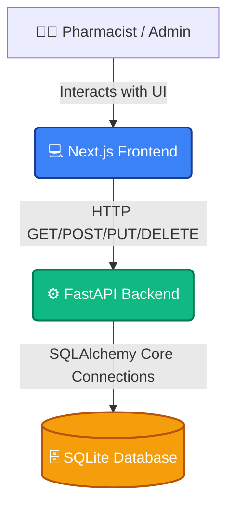
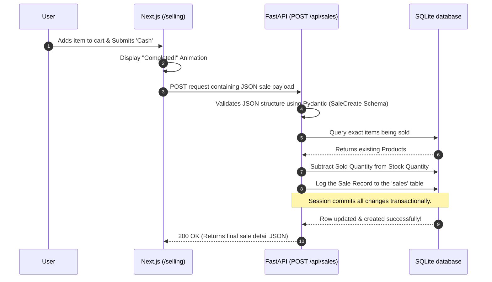

# Salveeya Medicine: Code Wiki

Welcome to the internal documentation and visual guide for the **Salveeya Medicine** web application. This document is designed to give developers an overview of the languages, frameworks, and architecture used to build the software.

---

## 🛠️ Technology Stack
The application is a full-stack, fully modern web project utilizing independent front-end and back-end directories.

### 🎨 Frontend
- **Framework:** Next.js (React) - Version 14+ used for client-side routing, hooks, and interface rendering.
- **Languages:** JavaScript (ES6+), JSX
- **Styling:** Vanilla CSS structure (via `globals.css`) and Tailwind CSS utility classes to design responsive layouts fast and efficiently without writing raw CSS for everything.
- **Icons:** `lucide-react` library for consistent, clean vector illustration.
- **Key Features:** Client-side state management (`useState`, `useEffect`), dynamic conditional rendering (e.g. Refund Mode variants, QR display, animations).

### ⚙️ Backend
- **Framework:** FastAPI - A modern, fast web framework for building APIs with Python.
- **Languages:** Python 3.8+
- **Data Validation:** Pydantic (`schemas.py`) - Enforces strict type-hints and shapes on incoming/outgoing JSON request bodies.
- **Database Mapping:** SQLAlchemy ORM (`models.py`) - Maps Python Classes directly to relational SQL tables.
- **Database Engine:** SQLite - A lightweight, serverless database engine, perfect for local pharmacy storage needs securely located in `pharmacy.db`.
- **Key Features:** Cross-Origin Resource Sharing (CORS) enabled to serve local Next.js ports, fully automatic `/docs` swagger page auto-generated by FastAPI.

---

## 🧩 Architectural Overview

The following diagram illustrates how the core layers of the application communicate. Next.js serves the modern interface to the User's browser, and uses native `fetch()` calls to interact with the FastAPI server hosted on `localhost:8000`.



---

## 📂 Backend File Structure & Relationships

FastAPI forces a highly decoupled ecosystem where schema validation, database session logic, and route logic are cleanly separated. 

```mermaid
graph LR
    classDef file fill:#f3f4f6,stroke:#9ca3af,stroke-width:2px,color:black,shape:rect;

    Main[📱 main.py\n(API Routes)]:::file
    Schemas[📝 schemas.py\n(Pydantic Validation)]:::file
    Models[🧱 models.py\n(SQLAlchemy Tables)]:::file
    DB[🔌 database.py\n(Engine & Sessions)]:::file

    Main -- "Imports schemas for Request tracking" --> Schemas
    Main -- "Imports models to query/create" --> Models
    Main -- "Imports get_db() to yield sessions" --> DB
    Models -- "Extends Base model" --> DB
```

---

## 🔄 Core Data Flow Example: Point of Sale (Selling)

When the user attempts to put items in a cart and click "Cash" to checkout, the following sequence occurs identically via the API to permanently deduct the cart items from the SQLite database.



---

## 🏗️ Major Application Features & Modules

1. **🏥 Dashboard (`/`)**
   - High-level numeric calculations fetching statistical aggregates (Total sales, total products, low stock warnings).
   
2. **🛒 Point of Sale (`/selling`)**
   - Interactive, dynamic layout calculating VAT, totals, handling cart manipulations in RAM before sending a single chunk request to the API. Includes a custom **Refund Mode** toggle allowing quantities to be subtracted.

3. **📦 Inventory management (`/inventory`)**
   - Real-time tabular tracking of current batches. Forms available to manually update product information, supplier tracking, and edit existing rows.

4. **🧾 Invoices (`/invoice`)**
   - Batch intake tracking. Invoices contain recursive one-to-many relationships matching a single supplier invoice to **dozens** of product rows. Supports expanding rows via chevron toggles to peek at individual array entries without a new page load.

5. **⚠️ Out of Stock & Expired (`/out-of-stock` & `/expired-items`)**
   - Granular alerting routes. Expired items performs real-time ISO date (`YYYY-MM-DD`) calculations against today's clock. Out Of Stock enforces strict `stock_quantity = 0` database WHERE clauses.
